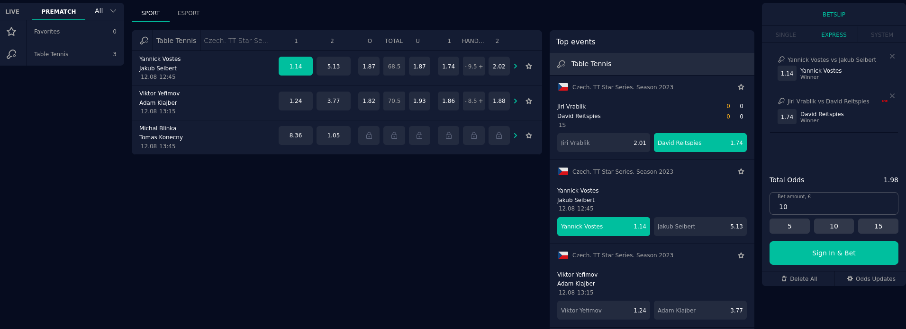

# DataBet SPA Example

This repository provides boilerplate code as an introduction to help you build your own betting application using the
[DataBet SPA](https://docs.data.bet/betting-spa/).

## Documentation

- [Betting Integration](https://docs.data.bet/betting-integration/)
- [Authorization](https://docs.data.bet/betting-integration-auth/)

## Getting Started

### Prerequisites

To run this project, you need to have
[Node.js 18+ and NPM](https://docs.npmjs.com/downloading-and-installing-node-js-and-npm) installed on your system.

### Setting up the Project

#### 1. Clone the Repository and Install Dependencies

```bash
git clone https://github.com/databet-cloud/spa-example
cd spa-example
npm install
```

#### 2. Retrieve Authorization Certificates from DataBet and Generate an Authorization Token for Your Project

```bash
curl --location https://betting.int.databet.cloud/token/create \
--cert    tls.crt \
--key     tls.key \
--data '{ "locale": "en", "currency": "EUR"}'
```

#### 3. Setting up Environment Variables
1. Create a file named `.env` in the root directory of this project
2. Copy the contents of the `.env.dist` file and paste them into the `.env` file.
3. Replace the values of the variables in the `.env` file with appropriate values:
  - `USER_TOKEN`: This is the authorization token retrieved from step #2
  - `GRAPHQL_URL`: GQL address provided by DataBet.
```plaintext
USER_TOKEN=your_actual_user_token_here
GRAPHQL_URL=your_gql_address_here
```
4. Save the `.env` file.

**Note:** the `.env` file contains sensitive information, so it is not recommended to disclose it publicly

#### 4. Build and Start the Server

```bash
npm run dev
```

Your browser will open automatically, and you'll see a configured SPA with sports events configured for your account.



Congratulations! You've successfully set up the SPA example!

## What's Next?

Once set up, you should integrate the [Callbacks API](https://docs.data.bet/betting-bet/) within your server. Explore
any additional APIs you need to realize the **Betting Application of Your Dreams**!
